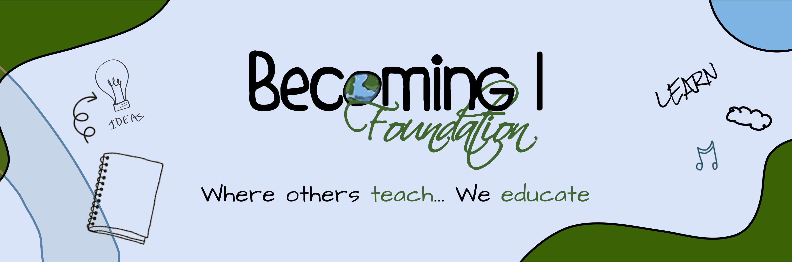

  

<!-- <h1 align="center">Becoming I Foundation</h1> -->

  Welcome to the official GitHub repository of Becoming I Foundation. Here, we collaborate on various projects to advance our mission of making quality education accessible to all.

  We are a college community dedicated to providing free, high-quality education. 

    
    
    

